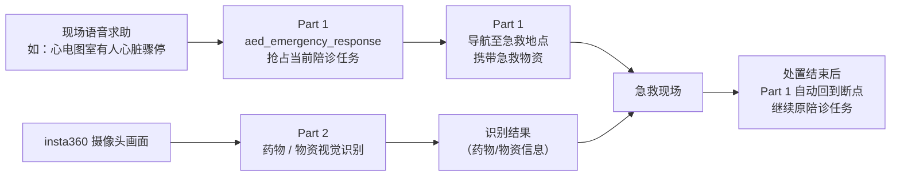

# 聆灵 —— 医院陪诊 AI 伙伴

当一个人去医院时，谁来陪她走完整个就医流程？

**聆灵**是面向医院就诊场景的 AI 陪伴伙伴，目标不只是"告诉你科室在哪"，而是从进门到看完病，全程有一个能带路、能陪伴、关键时刻能救急的伙伴陪着走完流程：迎接、挂号引导、科室带路、厕所等公共设施指引、跟随陪伴、跟丢提醒，以及 AED 急救情况下的物资/药物识别与配送导航。

> 本项目为黑客松二次开发原型，不是医疗器械，不替代医护人员、120 或 AED 设备本身的判断与指令。所有急救相关功能仅负责"任务编排与物资/信息呈现"，专业决策始终留给医护人员和合规医疗设备。

## 项目由两部分组成

聆灵的能力由两套协同工作的系统共同支撑：一套负责"人到哪、怎么走、怎么陪"（机器狗本体的移动与交互），一套负责"看到什么、能不能认出来"（insta360 摄像头的视觉识别）。两部分各自独立开发、独立目录、独立 README，通过急救联动等场景衔接。

| 部分 | 载体 | 解决的问题 | 详细说明 |
| --- | --- | --- | --- |
| **Part 1：机器狗陪诊导航** | Vbot 四足机器人「大头BoBo」+ ROS 2 | 迎接、挂号引导、科室带路、设施指引、跟随陪伴、跟丢暂停提醒、任务调度（含厕所插队、AED 任务抢占与断点恢复） | [`part1/README.md`](./part1/README.md) |
| **Part 2：insta360 视觉识别** | insta360 全景摄像头 | AED 急救场景下的药物/急救物资识别，为现场处置和物资配送提供视觉判断依据 | [`part2/README.md`](./part2/README.md) |

> 目录名以本仓库当前实际结构为准；如果两部分的文件夹命名和这里不一致，请以仓库里的真实路径为准，链接同步替换即可。

## 两部分如何协同

日常陪诊场景（迎接、带路、跟随、跟丢提醒、如厕引导）主要由 Part 1 独立完成，不依赖 Part 2。两部分的协同点集中在**急救场景**：



Part 1 负责"把对的物资和人送到现场、事后接回流程"，Part 2 负责"帮现场更快认出药物/物资是什么"；两者都遵守同一条边界——不做诊断、不替代医护人员的专业判断，只做任务编排、导航和识别辅助。两部分之间具体的接口/数据交换方式，请以各自 README 里的说明为准。

## 核心能力总览

- 到院迎接、语音欢迎
- 挂号引导、科室带路（跨楼层，按实时排队等待时间动态规划顺序）
- 厕所等公共设施指引（可临时插队，完成后自动接回原行程）
- 跟随陪伴、跟丢检测与暂停提醒
- AED 急救联动：任务抢占、物资配送导航、分步语音指导、断点恢复
- insta360 视觉识别：急救场景下的药物/物资识别，辅助现场判断

## 仓库结构（顶层）

```text
.
├── README.md                            # 项目总说明（当前文件）
├── part1_hospital_escort_robot/         # Part 1：机器狗陪诊导航（ROS 2）
│   ├── README.md                        # Part 1 详细说明（架构、构建、测试、部署）
│   ├── vbot_ws/                         # ROS 2 工作空间（五个业务功能包 + 仿真验收包）
│   ├── docs/                            # 架构与使用指南
│   ├── scripts/                         # 构建 / 启动 / 验收 / 发布脚本
│   ├── Dockerfile.sim
│   └── compose.yaml
└── part2_insta360_medication_id/        # Part 2：insta360 药物识别（视觉模块）
    └── README.md                        # Part 2 详细说明
```

## 快速开始

本仓库不提供跨两部分的统一构建脚本，两部分技术栈和运行环境相互独立，请分别进入对应目录，按各自 README 的说明搭建环境、构建和运行：

- 机器狗 / ROS 2 部分：见 [`part1_hospital_escort_robot/README.md`](./part1_hospital_escort_robot/README.md)（环境依赖、`colcon build`、仿真与真机接入、测试方式均在其中）
- insta360 视觉识别部分：见 [`part2_insta360_medication_id/README.md`](./part2_insta360_medication_id/README.md)

## 许可与免责声明

各部分的许可信息以其各自目录下的说明为准（Part 1 见 `part1_hospital_escort_robot/README.md` 及 `THIRD_PARTY_NOTICES.md`）。本项目为独立的二次开发工程，不应被表述为任何硬件厂商的官方产品；急救相关功能不做医疗判断、不自动给药、不决定 AED 是否放电，仅负责任务调度、导航与信息呈现，真实部署前须由医院急救与设备管理人员完成审核。
