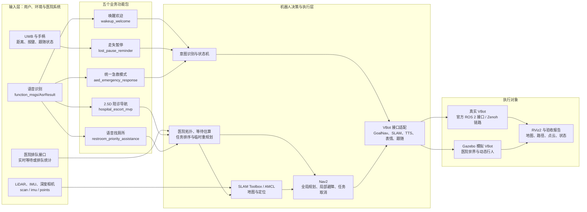
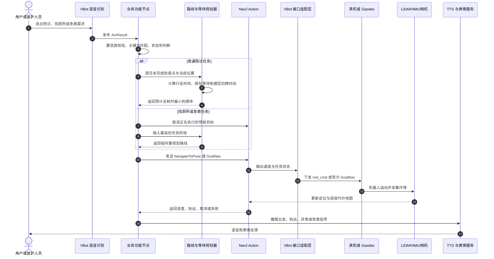

# 聆灵 VBot 医院服务机器人 ROS 2 源码项目

本项目是面向 VBot 机器狗的医院服务机器人 ROS 2 二次开发源码，不是单纯的界面演示或对话脚本。系统把语音、UWB、LiDAR、IMU、深度相机和医院排队数据转换为机器人可执行的建图、定位、导航、跟随暂停、任务抢占、避障和语音播报动作。

项目包含五个业务功能包和一个仿真验收包。没有真机时，可在 Gazebo、RViz2、Nav2 和 SLAM Toolbox 中验证主要软件链路；接入真机时，通过 VITA Dynamics 公开的 `vbot_ros2_msgs` 接口连接机器人能力。

> 当前定位：二次开发与仿真验证源码。应用逻辑和模拟链路已经过自动测试，但真机运动、真实传感器、网络 QoS、医院接口和现场安全必须在目标 VBot 上再次验收。本项目不是医疗器械，不替代医护人员、120 或 AED 设备指令。

## 系统逻辑框架



图中的五个业务包只负责明确的医院业务，不直接控制电机。所有移动请求先进入规划与接口适配层，再由 Nav2 或 VBot 官方 action 执行；这样可以统一处理任务取消、失败、超时、重定位和动态避障。

## 核心调用链路



这条调用链同时适用于仿真和真机。仿真环境由兼容桥模拟 VBot 接口，真机部署时由真实机器人接口替换兼容桥，业务节点不需要重写。

## 五个业务功能包

| 功能包 | 模块含义 | 主要输入 | 核心处理 | 行动输出 |
| --- | --- | --- | --- | --- |
| `wakeup_welcome` | 唤醒欢迎 | `/speech/WakeupInfo` | 校验唤醒来源、限制重复触发、等待服务就绪 | 播放欢迎表情，通过 TTS 以“聆灵”自称 |
| `lost_pause_reminder` | 走失暂停提醒 | UWB 距离、无线手柄、跟随状态 | 距离防抖、回差恢复、重复按键去重、控制请求重试 | 暂停/恢复跟随、取消导航、语音和表情提醒 |
| `hospital_escort_mvp` | 医院 2.5D 陪诊导航 | 点云、TF、语音、医院排队数据、医院点位图 | 三维体素建图、2.5D 投影、A*、多楼层拓扑、等待时间估算和任务排序 | 保存地图、切换定位地图、发送导航目标、输出陪诊状态 |
| `aed_emergency_response` | 统一急救模式 | 急救语音、地点词、导航反馈 | 识别心脏骤停、出血、过敏、低血糖等意图，抢占当前任务并选择物资 | 紧急导航、AED/急救物资配送、分步安全语音指导、RViz 标记 |
| `restroom_priority_assistance` | 独立语音找厕所 | `/asr/result` | 匹配厕所表达，生成与陪诊节点解耦的最高优先请求 | 取消当前路线、先去厕所、完成后恢复未完成检查 |

### 1. 唤醒欢迎

`wakeup_welcome_node.py` 订阅 VBot 唤醒消息。节点收到有效唤醒后，先调用表情服务，再调用语音服务。冷却时间内的重复唤醒会被忽略；服务暂时不可用时保留任务并重试，避免机器人只被唤醒却没有反馈。

### 2. 走失暂停提醒

`lost_pause_reminder_node.py` 同时观察 UWB 距离、跟随状态和手柄按键。连续超过距离阈值才判定跟丢，单个异常值不会触发；恢复距离采用回差阈值，防止机器人在边界附近反复暂停和恢复。判定跟丢后，节点先停止跟随并取消导航，再播报提醒。

### 3. 医院 2.5D 陪诊导航

该包是项目的导航和任务编排核心，主要源码模块如下。

| 源码模块 | 作用 |
| --- | --- |
| `mapping_planner_node.py` | 接收点云和 TF，更新三维体素地图，发布 2.5D 代价地图和规划路径 |
| `voxel_mapping.py` | 使用射线模型标记空闲体素与占据体素，并按机器人净空高度投影二维障碍 |
| `grid_planner.py` | 在膨胀后的栅格上执行八邻域 A*，禁止从障碍拐角斜穿 |
| `hospital_graph.py` | 表示科室、厕所、电梯、楼层和通行时间，计算跨楼层最短耗时路线 |
| `wait_time_planner.py` | 综合行走时间和预计排队时间，重排没有固定先后顺序的检查 |
| `cardiology_itinerary_node.py` | 执行心内科检查流程，处理等待、查询进度、厕所插队和剩余路线重规划 |
| `multi_floor_nav_node.py` | 执行跨楼层路线，处理电梯确认、地图切换、重定位和分段导航 |
| `floor_survey_node.py` | 接入真机 SLAM 服务，保存真实地图，并从 `map -> base_link` TF 记录点位 |
| `pickup_dispatch_node.py` | 校验可信网页或二维码请求，只允许导航到白名单接客点 |
| `vita_client.py` | 封装 VITA 导航、跟随、停止和语音接口，隔离业务代码与底层接口细节 |
| `mock_vbot_node.py` | 无真机时模拟官方服务、action、TF 和传感器数据 |
| `graph_export.py` | 把医院拓扑和路线导出为 JSON、Mermaid、DOT 和 SVG |

等待时间来源按以下优先级使用：

1. 医院接口返回的实时等待时间或排队人数、平均服务时长、开放窗口数。
2. 实时数据过期后，使用历史观测的指数加权平均值。
3. 从未收到医院数据时，使用 YAML 中配置的保守估算值。

规划目标不是单纯的几何最短路，而是尽量减小“行走 + 电梯 + 到达时仍需等待”的预计总时间。厕所请求会作为临时最高优先点插入，当前导航被取消，厕所任务完成后重新计算剩余检查顺序。

### 4. 统一急救模式

`aed_emergency_node.py` 从语音中识别急救类型和地点。有效请求会抢占普通陪诊任务，先发送停止目标，再导航到求助点。到达后按急救类型播报经过配置的指导语，并记录每一次意图接受、抢占、导航、到达和语音服务响应。

机器人只负责运送物资和播报预审话术，不诊断患者、不决定用药剂量，也不判断 AED 是否放电。真实部署前必须由医院急救和设备管理人员审核物资、地点和指导语。

### 5. 语音找厕所

`restroom_priority_node.py` 是独立意图入口，不和陪诊状态机写在同一个文件中。它只负责把“我想上厕所”“先去卫生间”等表达转换为结构化最高优先请求；陪诊节点负责取消当前 Nav2 目标、执行厕所路线并恢复剩余任务。厕所点位应记录在门外安全停靠区，不能把机器人导航到厕位内部。

## 仿真与验收模块

`vbot_simulation` 不属于业务功能包，它为没有真机的开发阶段提供可替换的执行环境。

| 模块 | 作用 |
| --- | --- |
| `vbot_simple.urdf.xacro` | 简化 VBot 外形、碰撞体、LiDAR、IMU、深度相机、AED 箱和急救物资箱 |
| `hospital.world` | 12×8 米医院走廊、诊室、门洞和可移动行人 |
| `goal_nav_bridge_node.py` | 把官方 `GoalNav` action 转换为 Nav2 `NavigateToPose` |
| `vbot_compat_bridge_node.py` | 模拟 `/vel_cmd` 和 VBot SLAM 服务，形成仿真/真机替换边界 |
| `dynamic_obstacle_node.py` | 控制人形障碍物横穿走廊，验证局部停车和恢复 |
| `mapping_driver_node.py` | 按固定路线代替人工遥控，验证建图与地图保存 |
| `simulation_acceptance_node.py` | 自动检查传感器、定位、规划、避障、导航 action 和报告输出 |
| `aed_sim_harness_node.py` | 注入急救语音并生成 Gazebo/Nav2 急救验收报告 |
| `second_dev_demo_node.py` | 模拟语音、外设和状态，统一展示业务功能调用结果 |

RViz2 用于显示机器人模型、TF、激光、点云、地图、全局路径、局部代价地图和急救标记；Gazebo 用于显示机器人在医院环境中的实际运动和动态障碍物交互。

## 与传统导诊项目的差异

| 对比项 | 数字人导诊软件 | 传统固定流程导诊机器人 | 本项目 |
| --- | --- | --- | --- |
| 系统边界 | 屏幕问答和信息展示 | 预设点位讲解或固定路线 | 感知、决策、规划、运动和语音闭环 |
| 环境理解 | 不感知真实空间 | 依赖固定地图，环境变化处理有限 | LiDAR/IMU/相机建图定位，Nav2 动态代价地图避障 |
| 任务规划 | 返回文字或页面 | 按固定顺序前往点位 | 同时计算行走、电梯和排队等待，可动态重排 |
| 临时需求 | 中断对话后重新选择 | 通常需要人工改路线 | 厕所和急救任务可抢占当前导航，完成后恢复原任务 |
| 机器人接口 | 无实体执行接口 | 多为厂商封闭控制 | 使用 ROS 2 topic/service/action，并与公开 VBot 接口对齐 |
| 无真机验证 | 只能测页面和接口 | 常依赖实体样机 | Gazebo + RViz2 + Nav2 + 自动验收报告 |
| 安全处理 | 主要是内容审核 | 依赖人工看护 | 距离防抖、停止、取消、超时、重定位、失败状态和医疗边界 |

核心差异在于：本项目交付的是可编译、可测试、可接入实体机器狗的机器人源码工程。语音不是最终结果，而是触发物理任务的输入；地图、定位、路径、传感器反馈和 action 状态共同决定机器人是否可以继续行动。

## 官方接口与运行基线

本仓库按 VITA Dynamics 公开接口库配置：

- Ubuntu 22.04 LTS
- ROS 2 Humble
- Python 3.10
- `colcon` 与 `rosdep`
- `function_msgs`、`speech_msgs`、`peripheral_msgs`、`lowlevel_msg`、`slam_msgs`

官方消息定义位于 `vbot_ws/src/vbot_ros2_msgs`，已逐文件核对上游提交 `a598337a7c4ec6a13cfe28ec6a8adf6866278a3c`。该目录是生成型接口源码快照，不应直接修改其中的 `.msg`、`.srv`、`.action`、`package.xml` 或 `CMakeLists.txt`。升级接口时必须替换整个上游版本并重新执行编译、接口测试和真机回归。

生产和 CI 建议使用 Ubuntu 22.04 x86_64。macOS 适合作为编辑和 Docker 宿主；完整 ROS 2 Humble 与 Gazebo Classic 环境在 Linux 容器中运行。Apple Silicon 使用 `linux/amd64` 仿真镜像，运行速度通常低于原生 Linux。

## 构建

原生 Ubuntu 安装依赖：

```bash
sudo apt update
sudo apt install -y \
  ros-humble-desktop \
  ros-humble-navigation2 \
  ros-humble-nav2-bringup \
  ros-humble-slam-toolbox \
  ros-humble-gazebo-ros-pkgs \
  ros-humble-xacro \
  python3-colcon-common-extensions \
  python3-rosdep python3-pytest python3-yaml
```

构建整个工作空间：

```bash
source /opt/ros/humble/setup.bash
cd vbot_ws
rosdep install --from-paths src --ignore-src -r -y
colcon build --symlink-install
source install/setup.bash
```

只构建五个业务包：

```bash
colcon build --symlink-install --packages-select \
  wakeup_welcome lost_pause_reminder hospital_escort_mvp \
  aed_emergency_response restroom_priority_assistance
```

## 启动仿真与可视化

构建并进入完整仿真容器：

```bash
docker compose build vbot_sim
docker compose run --rm --service-ports vbot_sim
```

容器内构建并启动综合演示：

```bash
build_vbot_ws
source /vbot_ws/install/setup.bash
ros2 launch vbot_simulation second_dev_demo.launch.py
```

具体的 Gazebo、RViz2、浏览器可视化和验收命令见 [VBot Gazebo 仿真说明](docs/guides/VBot_Gazebo仿真说明.md)，其余专题文档见 [文档目录](docs/README.md)。

## 测试

运行五个功能包的单元测试：

```bash
cd vbot_ws
colcon test --packages-select \
  wakeup_welcome lost_pause_reminder hospital_escort_mvp \
  aed_emergency_response restroom_priority_assistance
colcon test-result --verbose
```

运行节点、官方消息、服务和 action 同时参与的黑盒集成测试：

```bash
VBOT_WS=/vbot_ws VBOT_INSTALL_PREFIX=/vbot_ws/install \
  /workspace/scripts/test/run_feature_integration_tests.sh
```

检查源码语法、版本一致性和仓库垃圾文件：

```bash
./scripts/quality/check_repository_clean.sh
```

生成不包含 macOS 元数据和 Python 缓存的交付包：

```bash
./scripts/release/create_release_archive.sh 0.2.0
```

交付文件输出到 `dist/`。该目录默认不进入 Git，压缩包应作为 GitHub Release 附件发布，不应提交到源码分支。

## 真机建图接入

仿真建图和真实建图使用相同的“传感器数据 → TF → 地图 → 规划”逻辑，但数据来源不同：

1. 把 `mapping_planner.yaml` 中的点云话题、`map` 坐标系和机身坐标系替换为真机实际名称。
2. 使用 `floor_survey_node.py` 调用 VBot SLAM 建图服务，并遥控机器人覆盖走廊、诊室门口和回环区域。
3. 调用官方 `SaveMap` 服务保存地图；确认 `SlamStatus` 报告地图就绪。
4. 在每个安全停靠点读取 `map -> base_link` TF，记录科室、电梯、厕所和接客点。
5. 切换到定位模式，验证初始定位、重定位、Nav2 取消、动态障碍物和断网降级。

源码已实现接口调用和状态检查，但真实点云质量、TF 树、地图持久化位置、运动限速和机器人足端安全只能在真机现场确认。

## 仓库结构

```text
.
├── README.md                         # 项目统一说明
├── Dockerfile.sim                    # Humble、Gazebo、RViz2、Nav2、SLAM 环境
├── compose.yaml                      # 开发与仿真容器
├── docs/                             # 架构、使用指南和业务场景文档
├── scripts/                          # 构建、启动、验收、检查和发布脚本
└── vbot_ws/
    ├── src/
    │   ├── wakeup_welcome/           # 唤醒欢迎
    │   ├── lost_pause_reminder/      # 走失暂停提醒
    │   ├── hospital_escort_mvp/      # 2.5D 陪诊导航
    │   ├── aed_emergency_response/   # 统一急救模式
    │   ├── restroom_priority_assistance/ # 语音找厕所
    │   ├── vbot_simulation/          # 仿真与验收支持
    │   └── vbot_ros2_msgs/           # VITA 官方公开接口快照
    ├── maps/                          # 运行时地图，不提交生成内容
    └── reports/                       # 自动验收报告，不提交生成内容
```

## 发布前检查

1. 把五个 `package.xml` 和 `setup.py` 中的示例维护者邮箱替换为真实项目联系人。
2. 执行 `scripts/quality/check_repository_clean.sh`，确认没有缓存、隐藏文件和版本不一致。
3. 在 Ubuntu 22.04 + ROS 2 Humble 环境重新编译并运行全部测试。
4. 记录使用的 `vbot_ros2_msgs` 上游提交号、VBot 固件版本和 Nav2 参数版本。
5. 把源码提交到 GitHub，把 ZIP、TAR.GZ 和 SHA-256 文件上传到 GitHub Release。

## 许可与上游声明

五个业务包采用 Apache-2.0。VITA Dynamics 官方接口的版权和许可归上游项目所有，详见 [第三方声明](THIRD_PARTY_NOTICES.md) 和 `vbot_ws/src/vbot_ros2_msgs/LICENSE`。本项目是独立的二次开发工程，不应表述为 VITA Dynamics 官方产品。
